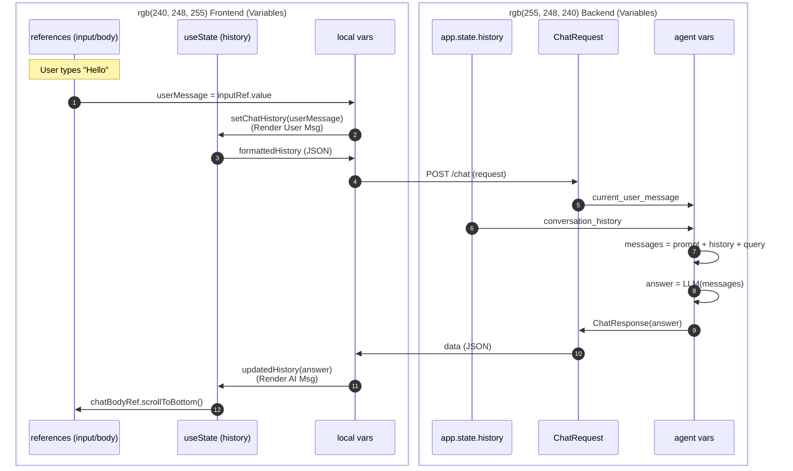

# 상세 데이터 흐름 & 변수 추적 가이드 (Data Flow Walkthrough)

이 문서는 프로젝트에 존재하는 **모든 변수(Variables)**와 **상태(State)**가 어디서 생성되고, 어떻게 변하며, 어디서 소멸하는지 **전수 조사**하여 정리한 백과사전이자 매뉴얼입니다.

---

## 1. 변수 백과사전 (Variable Encyclopedia)

코드에 등장하는 모든 변수의 정체와 역할을 정리했습니다.

### 1-1. 프론트엔드 변수 (React)

| 변수명 (Variable)  | 초기값/출처   | 변경 시점 (Trigger)         | 역할 (Role)                                   |
| :----------------- | :------------ | :-------------------------- | :-------------------------------------------- |
| **`showChatbot`**  | `true`        | 토글 버튼 클릭              | 챗봇 창의 표시 여부 제어 (`useState`)         |
| **`chatHistory`**  | `[]`          | 전송 클릭 / 응답 수신       | 화면에 표시될 대화 목록 전체 (`useState`)     |
| **`chatBodyRef`**  | `null`        | 컴포넌트 마운트 시          | 스크롤을 조작할 채팅창 DOM 요소 (`useRef`)    |
| **`inputRef`**     | `null`        | 컴포넌트 마운트 시          | 사용자가 글을 쓰는 입력창 DOM 요소 (`useRef`) |
| `userMessage`      | `input.value` | 폼 전송 시 (`handleSubmit`) | 사용자가 입력한 방금 막 쓴 텍스트             |
| `formattedHistory` | `chatHistory` | API 요청 직전               | 구글 API 규격에 맞춰 재가공된 대화 목록       |

### 1-2. 백엔드 변수 (FastAPI/LangChain)

| 변수명 (Variable)       | 정의/출처     | 역할 (Role)                                  |
| :---------------------- | :------------ | :------------------------------------------- |
| **`app.state.history`** | `[]`          | 서버 메모리에 저장된 전역 대화 기록 (휘발성) |
| `request`               | `ChatRequest` | 클라이언트가 보낸 JSON이 변환된 파이썬 객체  |
| `current_user_message`  | `string`      | 복잡한 객체 속에서 꺼내온 '진짜 질문 텍스트' |
| `system_prompt`         | `string`      | "너는 법률 전문가야"라는 AI 가스라이팅(Rule) |
| `state`                 | `dict`        | LangGraph 에이전트가 생각할 때 쓰는 메모장   |
| `answer`                | `string`      | AI가 최종적으로 생성한 답변 텍스트           |

---

## 2. 단계별 상세 분석 (Step-by-Step Narrative)

초보자도 이해할 수 있도록 데이터가 흘러가는 과정을 이야기처럼 풀어 씁니다.

### Step 1: 프론트엔드 - 포장하기 (Formatting)

사용자가 엔터를 치는 순간(`handleSubmit`), 코드는 날것의 텍스트를 상자에 담습니다.

**📂 파일: `front/src/components/ChatForm.jsx`**

```javascript
// 1. HTML 입력창에서 값을 꺼냅니다.
const userMessage = inputRef.current.value.trim();
// 👉 변수 상태: "전세 사기 예방법" (단순 문자열)

// 2. 화면에 보여주기 위해 React 상태(State)에 저장합니다.
setChatHistory((history) => [
  ...history,
  { role: 'user', text: userMessage }, // 👉 객체(Object)로 변신!
]);
```

**📂 파일: `front/src/App.jsx`**

```javascript
// 3. 서버로 보내기 위해 'formattedHistory'라는 새로운 형태로 가공합니다.
const formattedHistory = history.map(({ role, text }) => ({
  role: role === 'user' ? 'user' : 'model',
  parts: [{ text: text }], // 👉 구글 스타일의 깊은 구조로 다시 포장
}));

// 4. 최종적으로 JSON 문자열로 변환되어 네트워크를 탑니다.
body: JSON.stringify({ contents: formattedHistory });
```

> **설명**: "전세 사기"라는 글자가 `userMessage`라는 컵에 담겼다가, `chatHistory`라는 쟁반에 올라가고, 마지막엔 `formattedHistory`라는 택배 상자에 포장되어 트럭(`fetch`)을 타고 떠납니다.

---

### Step 2: 백엔드 - 해석하기 (Parsing)

인터넷을 타고 넘어온 JSON 택배가 파이썬의 세계로 들어옵니다.

**📂 파일: `back/main.py`**

```python
# 1. FastAPI가 JSON을 받아서 미리 정의해둔 'ChatRequest' 종이 틀(Class)에 맞춥니다.
async def chat_endpoint(request: ChatRequest):
    # 👉 request 변수는 이제 단순한 글자가 아니라, .contents로 접근 가능한 '객체'가 됩니다.

# 2. 복잡한 포장지를 뜯어내고 알맹이(텍스트)만 쏙 뺍니다.
current_user_message = request.contents[-1].parts[0].get("text", "")
# 👉 변수 상태: "전세 사기 예방법" (다시 단순 문자열로 돌아옴!)

# 3. AI 뇌(Agent)에게 이 알맹이를 던져줍니다.
response = await process_query(current_user_message, conversation_history)
```

> **설명**: 서버는 택배 상자(`request`)를 받아서 포장지를 뜯고, 그 안에 있는 진짜 내용물(`current_user_message`)만 꺼내서 AI에게 전달합니다.

---

### Step 3: AI 에이전트 - 생각하기 (Reasoning)

이제 가장 똑똑한 함수인 `agent.py`가 작동합니다.

**📂 파일: `back/agent.py`**

```python
async def process_query(query, conversation_history):
    # 1. 질문을 리스트(List) 형태의 메시지로 만듭니다.
    messages = [HumanMessage(content=query)]
    # 👉 변수 상태: [HumanMessage(content="전세 사기 예방법")]

    # 2. LangChain 에이전트가 이 메시지를 보고 판단합니다.
    response = await agent.ainvoke({"messages": messages})
    # 🤔 AI의 독백: "법률 질문이네? 검색(Search Tool)을 좀 해봐야겠어."

    # 3. 최종 답변만 뽑아냅니다.
    answer = ai_message[-1].content
    # 👉 변수 상태: "전세 사기 피해를 막으려면 계약 전에 등기부등본을..." (긴 문자열)

    return answer
```

> **설명**: AI는 질문을 받으면 바로 대답하 지 않고, "이게 무슨 질문이지?" 하고 생각(`Reading`)한 뒤, 필요하면 도구(`Tool`)를 써서 답을 만들어냅니다.

---

### Step 4: 반환 (Return Trip)

만들어진 답변은 왔던 길을 거슬러 올라가 사용자에게 도착합니다.

1. `agent.py`가 `answer` 문자열 반환
2. `main.py`가 `ChatResponse` 객체(`{"text": answer}`)로 재포장
3. `App.jsx`가 받아서 `setChatHistory`로 화면 업데이트
4. 사용자는 화면에서 답변 확인 완료!

---

## 3. 상태 변화 타임라인 (State Transition Timeline)

핵심 상태 변수인 **`chatHistory`**가 시간 흐름에 따라 어떻게 변하는지 추적합니다.

**상황: 사용자가 "안녕"이라고 입력했을 때**

1.  **초기 상태 (Initial)**
    - `chatHistory`: `[]`

2.  **사용자 입력 직후 (`handleSubmit`)**
    - `setChatHistory([...history, {role: 'user', text: '안녕'}])` 실행
    - `chatHistory`: `[{role: 'user', text: '안녕'}]`
    - 🛑 **화면 갱신 1**: 사용자의 말풍선이 화면에 보임.

3.  **로딩 표시 (`setTimeout` 내부)**
    - `setChatHistory([...history, {role: 'model', text: '생각중 ...'}])` 실행
    - `chatHistory`: `[{role: 'user', text: '안녕'}, {role: 'model', text: '생각중 ...'}]`
    - 🛑 **화면 갱신 2**: 챗봇 말풍선에 "생각중 ..."이 뜸.

4.  **API 응답 수신 후 (`updatedHistory`)**
    - `prev.filter(...)`로 "생각중 ..." 메시지 삭제
    - 새로운 답변 "반갑습니다" 추가
    - `chatHistory`: `[{role: 'user', text: '안녕'}, {role: 'model', text: '반갑습니다'}]`
    - 🛑 **화면 갱신 3**: "생각중 ..."이 사라지고 실제 답변이 보임.

---

## 4. React 심화 분석: 상태(State)와 속성(Props)의 마법

React가 어떻게 데이터를 다루는지 포스트잇과 심부름에 비유해 설명합니다.

### 4.1. `useState` (변하는 데이터 = 포스트잇)

> **"화면에 보여지는 내용은 일반 변수가 아니라 반드시 State로 만들어야 한다."**

1.  **선언**: `chatHistory`는 현재의 대화 목록이고, `setChatHistory`는 이 목록을 수정하는 유일한 도구(함수)입니다.
2.  **작동 원리**: 우리가 `userMessage` 변수에 "안녕"을 담는다고 화면이 바뀌지 않습니다. 반드시 `setChatHistory(["안녕"])`이라고 **신호**를 줘야, React가 "아! 데이터가 바뀌었네? 화면을 다시 그려야겠다(Re-render)"라고 인식합니다.

### 4.2. `props` (데이터 전달 = 심부름)

> **"부모(App)가 자식(ChatForm)에게 주는 선물 보따리."**

1.  **상황**: `ChatForm`은 채팅을 입력받는 화면일 뿐, 실제 데이터를 저장하는 곳(`chatHistory`)은 부모인 `App`에 있습니다.
2.  **전달**: 부모(`App`)는 자신의 함수인 `generateChatResponse`와 `setChatHistory`를 자식(`ChatForm`)에게 `props`라는 보따리에 싸서 내려보냅니다.
3.  **사용**: 자식(`ChatForm`)이 이 함수를 실행하면, 실제로는 **부모(`App`)의 공간에서** 함수가 실행되어 부모의 상태(`chatHistory`)가 바뀝니다. "엄마 카드로 자식이 결제하는 것"과 같습니다.

### 4.3. `useEffect` (변화 감지 = 알림 설정)

> **"특정 데이터가 변할 때만 몰래 실행되는 뒷정리 요원."**

1.  **목적**: 화면이 다 그려진 **다음에** 무언가를 하고 싶을 때 사용합니다.
2.  **시나리오**: 사용자가 메시지 전송 ➔ `setChatHistory`로 목록 추가 ➔ 화면이 다시 그려짐(메시지 보임) ➔ **그 직후에** `useEffect`가 발동 ➔ 스크롤을 쭈욱 내려서 새 메시지를 보여줌.

---

## 5. 시퀀스 다이어그램 (Sequence Diagram)

전체 시스템의 변수 이동 경로를 시각화했습니다.


