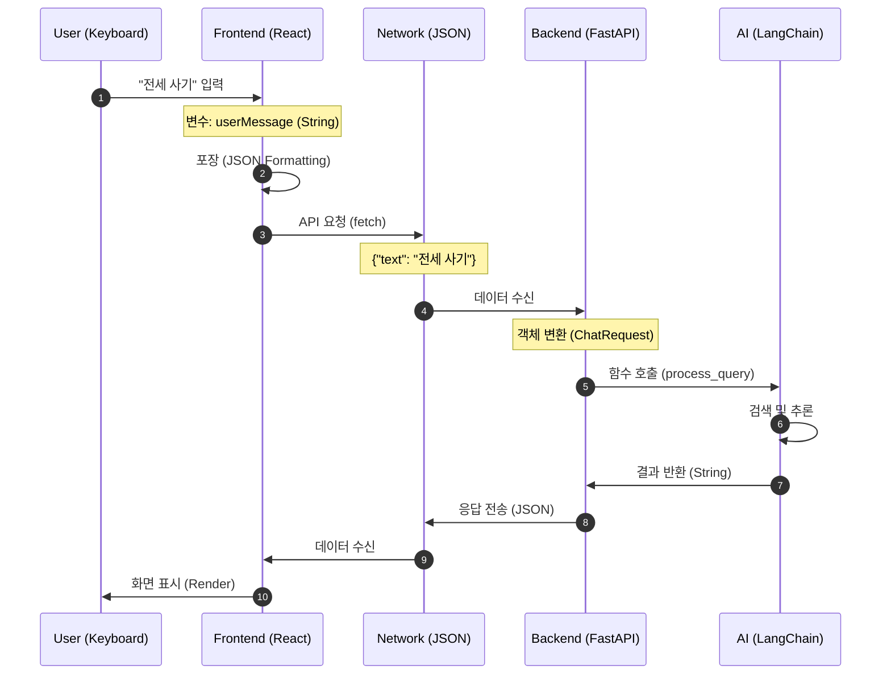

# 상세 데이터 흐름 & 변수 추적 가이드 (Data Flow Walkthrough)

이 문서는 **"사용자가 입력한 글자가 코드를 타고 어디로 이동해서 어떻게 변하는지"**를 초보자도 이해할 수 있도록 그림과 함께 아주 상세하게 설명합니다.

---

## 1. 데이터의 여정 (Overall Journey)

우리는 **"전세 사기 예방법"**이라는 텍스트가 여행하는 과정을 추적할 것입니다.



---

## 2. 단계별 상세 분석 (Step-by-Step Analysis)

### Step 1: 프론트엔드 - 포장하기 (Formatting)

사용자가 엔터를 치는 순간(`handleSubmit`), 코드는 날것의 텍스트를 상자에 담습니다.

**📂 파일: `front/src/components/ChatForm.jsx`**

```javascript
// 1. HTML 입력창에서 값을 꺼냅니다.
const userMessage = inputRef.current.value.trim();
// 👉 변수 상태: "전세 사기 예방법" (단순 문자열)

// 2. 화면에 보여주기 위해 React 상태(State)에 저장합니다.
setChatHistory((history) => [
  ...history,
  { role: 'user', text: userMessage }, // 👉 객체(Object)로 변신!
]);
```

**📂 파일: `front/src/App.jsx`**

```javascript
// 3. 서버로 보내기 위해 'formattedHistory'라는 새로운 형태로 가공합니다.
const formattedHistory = history.map(({ role, text }) => ({
  role: role === 'user' ? 'user' : 'model',
  parts: [{ text: text }], // 👉 구글 스타일의 깊은 구조로 다시 포장
}));

// 4. 최종적으로 JSON 문자열로 변환되어 네트워크를 탑니다.
body: JSON.stringify({ contents: formattedHistory });
```

#### 🖼️ 그림으로 보는 프론트 변수 흐름

```mermaid
graph TD
    Input[Keyboard Input] -->|ref.current.value| StringVar("String: '전세 사기'")
    StringVar -->|setChatHistory| StateObj("State Object: { role: 'user', text: '...' }")
    StateObj -->|map() function| ApiJSON("JSON: { parts: [{ text: '...' }] }")
    ApiJSON -->|fetch()| Internet((Internet))
```

---

## 3. 백엔드 - 해석하기 (Parsing)

인터넷을 타고 넘어온 JSON 데이터가 파이썬의 세계로 들어옵니다.

**📂 파일: `back/main.py`**

```python
# 1. FastAPI가 JSON을 받아서 미리 정의해둔 'ChatRequest' 종이 틀(Class)에 맞춥니다.
async def chat_endpoint(request: ChatRequest):
    # 👉 request 변수는 이제 단순한 글자가 아니라, .contents로 접근 가능한 '객체'가 됩니다.

# 2. 복잡한 포장지를 뜯어내고 알맹이(텍스트)만 쏙 뺍니다.
current_user_message = request.contents[-1].parts[0].get("text", "")
# 👉 변수 상태: "전세 사기 예방법" (다시 단순 문자열로 돌아옴!)

# 3. AI 뇌(Agent)에게 이 알맹이를 던져줍니다.
response = await process_query(current_user_message, conversation_history)
```

#### 🖼️ 그림으로 보는 백엔드 변수 흐름

```mermaid
graph TD
    Internet((Internet)) -->|JSON| PydanticModel("Class: ChatRequest")
    PydanticModel -->|.contents[-1]| CoreVar("Variable: current_user_message")
    CoreVar -->|Function Call| AgentFunc[("agent.process_query()")]
```

---

## 4. AI 에이전트 - 생각하기 (Reasoning)

이제 가장 똑똑한 함수인 `agent.py`가 작동합니다.

**📂 파일: `back/agent.py`**

```python
async def process_query(query, conversation_history):
    # 1. 질문을 리스트(List) 형태의 메시지로 만듭니다.
    messages = [HumanMessage(content=query)]
    # 👉 변수 상태: [HumanMessage(content="전세 사기 예방법")]

    # 2. LangChain 에이전트가 이 메시지를 보고 판단합니다.
    response = await agent.ainvoke({"messages": messages})

    # 3. 에이전트 내부 판단 과정 (Mental Model)
    # "법률 질문이네?" -> "Search Tool 실행" -> "결과 요약" -> "최종 답변 생성"

    # 4. 최종 답변만 뽑아냅니다.
    answer = ai_message[-1].content
    # 👉 변수 상태: "전세 사기 피해를 막으려면..." (긴 문자열)

    return answer
```

---

## 5. 반환 (Return Trip)

만들어진 답변은 왔던 길을 거슬러 올라가 사용자에게 도착합니다.

1. `agent.py`가 `answer` 문자열 반환
2. `main.py`가 `ChatResponse` 객체(`{"text": answer}`)로 포장
3. `App.jsx`가 받아서 `setChatHistory`로 화면 업데이트
4. 사용자는 화면에서 답변 확인 완료!

---

### 💡 초보자를 위한 멘토링

- **변수는 그릇입니다**: 같은 "전세 사기"라는 내용이라도, 프론트엔드에서는 `userMessage`라는 그릇에 담기고, 백엔드에서는 `request`라는 큰 박스에 담겼다가, 다시 `query`라는 작은 그릇으로 옮겨 담아집니다.
- **함수는 공장입니다**: `generateChatResponse` 공장은 데이터를 포장하고, `process_query` 공장은 데이터를 가공해서 새로운 결과물(답변)을 만들어냅니다.
- **흐름을 놓치면 로그를 찍으세요**: 데이터가 어디서 변하는지 모르겠다면, `print(변수명)`(파이썬)이나 `console.log(변수명)`(자바스크립트)을 코드 중간중간에 넣어서 변수의 현재 모양을 확인해보는 것이 최고의 공부법입니다.

---

## 6. React 심화 분석: 상태(State)와 속성(Props)의 마법

React가 어떻게 데이터를 다루는지 포스트잇과 심부름에 비유해 설명합니다.

### 6.1. `useState` (변하는 데이터 = 포스트잇)

> **"화면에 보여지는 내용은 일반 변수가 아니라 반드시 State로 만들어야 한다."**

**코드 예시 (`App.jsx`)**

```javascript
const [chatHistory, setChatHistory] = useState([]);
```

1.  **선언**: `chatHistory`는 현재의 대화 목록이고, `setChatHistory`는 이 목록을 수정하는 유일한 도구(함수)입니다.
2.  **작동 원리**:
    - 우리가 `userMessage` 변수에 "안녕"을 담는다고 화면이 바뀌지 않습니다.
    - 반드시 `setChatHistory(["안녕"])`이라고 **신호**를 줘야, React가 "아! 데이터가 바뀌었네? 화면을 다시 그려야겠다(Re-render)"라고 인식합니다.
3.  **실제 흐름**:
    - 사용자 입력 ➔ `setChatHistory` 호출 ➔ React가 변경 감지 ➔ `App` 컴포넌트 재실행 ➔ 바뀐 `chatHistory`를 가지고 화면을 새로 그림.

### 6.2. `props` (데이터 전달 = 심부름)

> **"부모(App)가 자식(ChatForm)에게 주는 선물 보따리."**

**코드 예시 (`App.jsx` -> `ChatForm.jsx`)**

```javascript
// App.jsx (부모)
<ChatForm
  generateChatResponse={generateChatResponse}
  setChatHistory={setChatHistory}
/>
```

1.  **상황**: `ChatForm`은 채팅을 입력받는 화면일 뿐, 실제 데이터를 저장하는 곳(`chatHistory`)은 부모인 `App`에 있습니다.
2.  **전달**: 부모(`App`)는 자신의 함수인 `generateChatResponse`와 `setChatHistory`를 자식(`ChatForm`)에게 `props`라는 보따리에 싸서 내려보냅니다.
3.  **사용**: 자식(`ChatForm`)이 이 함수를 실행하면, 실제로는 **부모(`App`)의 공간에서** 함수가 실행되어 부모의 상태(`chatHistory`)가 바뀝니다. "엄마 카드로 자식이 결제하는 것"과 같습니다.

### 6.3. `useEffect` (변화 감지 = 알림 설정)

> **"특정 데이터가 변할 때만 몰래 실행되는 뒷정리 요원."**

**코드 예시 (`App.jsx`)**

```javascript
useEffect(() => {
  // 스크롤을 맨 아래로 내리는 코드
  chatBodyRef.current.scrollTo({ ... });
}, [chatHistory]); // 👈 [의존성 배열]
```

1.  **목적**: 화면이 다 그려진 **다음에** 무언가를 하고 싶을 때 사용합니다.
2.  **의존성 배열 (`[chatHistory]`)**:
    - "React야, 모든 게 변할 때마다 실행하지 말고, 딱 `chatHistory`가 변했을 때만 이 코드를 실행해줘!"라는 뜻입니다.
3.  **시나리오**:
    - 사용자가 메시지 전송 ➔ `setChatHistory`로 목록 추가 ➔ 화면이 다시 그려짐(메시지 보임) ➔ **그 직후에** `useEffect`가 발동 ➔ 스크롤을 쭈욱 내려서 새 메시지를 보여줌.
    - 만약 `useEffect`가 없다면? 새 메시지는 왔는데 스크롤이 위에 머물러서 사용자가 직접 내려야 합니다.
